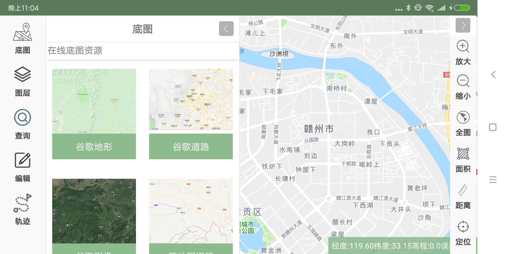

# UCMapViewer —— 基于UCMap的通用地图框架

# 一、效果

## 工程列表


## 在线底图



## 图层控制


## 影像透明度


## 矢量渲染样式设置


## 矢量渲染样式设置


## 模糊查询


## 距离量算


## 面积量算


## 要素编辑


## 精确几何编辑


## 创建矢量图层


## 图元属性编辑


## 指北针、比例尺、GPS状态信息


## 地图常规操作(放大、缩小、全图，拖拽，倾斜，旋转)


## 轨迹


## 数据源

- `Google` wmts地图服务(在线)
- `天地图` wmts(在线)
- `OGC WMTS`
- `OGC WFS`
- `ArcGIS Server`
- `MBTiles`
- `GeoJson`
- `GeoTiff`、`tiff`、`png`
- `ESRI Shapefile`
- `GPX`

# 二、如何使用

1. 下载`Release`目录中的`UCMapViewer.apk` 安装到手机或平板
2. 下载`readme` 目录中的`示例`数据,将其拷贝到 SD卡根目录下的 `UCMapViewer\Projects` 目录下
3. 启动App。
4. 动手制作自定义数据。

# 三、如何开发

1. 下载源码,项目工程源码需要用Android Studio 编译。
2. 代码编码为`utf-8` 如中文注释乱码，请切换编辑器的编码格式
3. 项目引用了jcenter上两个外部项目,编译时请保证网络畅通。

# 四、源码结构

* `FrameWork` —— 框架
  * `Config` —— 配置相关
  * `EventBus` —— 事件总线
  * `MapModule` —— 地图模块
  * `ProjectsModule` —— 工程列表模块
  * `RootAct` —— 应用程序启动页
* `GloabApp` —— 应用程序全局

# 五、扩展

## 1.创建自定义模块类

在Widgets目录下创建HelloWorld.java文件并添加以下内容。

```java
public class HelloWorld extends BaseModule {

    public View mWidgetView = null;//
    /**
     * 组件面板打开时，执行的操作
     * 当点击widget按钮是, WidgetManager将会调用这个方法，面板打开后的代码逻辑.
     * 面板关闭将会调用 "inactive" 方法
     */
    @Override
    public void active() {

        super.active();//默认需要调用，以保证切换到其他widget时，本widget可以正确执行inactive()方法并关闭
        super.showWidget(mWidgetView);//加载UI并显示

        super.showMessageBox(super.name);//显示组件名称

    }

    /**
     * widget组件的初始化操作，包括设置view内容，逻辑等
     * 该方法在应用程序加载完成后执行
     */
    @Override
    public void create() {
        LayoutInflater mLayoutInflater = LayoutInflater.from(super.context);
        //设置widget组件显示内容
        mWidgetView = mLayoutInflater.inflate(R.layout.widget_view_helloworld,null);

    }

    /**
     * 组件面板关闭时，执行的操作
     * 面板关闭将会调用 "inactive" 方法
     */
    @Override
    public void inactive(){
        super.inactive();
    }

}
```

## 2.设计布局xml


## 3、配置文件中添加对应内容
`assets/config.xml`下添加以下内容：
```xml
 <module label="测试" classname="com.node.ucmapviewer.Moodules.HelloWorld" config=""/>
```

## 4.Module中操作Mapview对象
每一个Module扩展了父类BaseModule。使用以下方法就可以获取并操作mapview对象中的内容。
```java
MapView mapview = super.mapView;

```

## 5.widget之间通讯
Module之间通信通过引入EventBus 3.0实现。基本使用如下：

### 订阅
```java
EventBus.getDefault().register(this);//订阅
```
### 解除订阅
```java
EventBus.getDefault().unregister(this);//解除订阅
```

### 发布事件
```java
EventBus.getDefault().post(new MessageEvent("事件说明"));
```

### 事件处理
```java
@Subscribe(threadMode = ThreadMode.MAIN) 
public void onDataSynEvent(MessageEvent event) {
    Log.e(TAG, "event---->" + event.getMessage());
    //通过判断message内容执行不同方法
}
```


# 五、 工程文件

UCMapViewer 是以工程文件夹为单位进行数据管理的,所有工程在系统根目录`/UCMapViewer/Projects`下
每个工程都有工程索引文件 如`XXX工程/xxx工程.json`
```
{
    "layers": [
		{
            "name": "天地图影像",
            "type": "mbtiles",
            "path": "world.mbtiles",
            "layerIndex": 1,
            "visible": true,
            "minlevel":0,
            "maxlevel":18,
            "ahpla":0.9         
        },
        {
            "name": "全国县级行政区",
            "type": "shapefile",
            "path": "all.shp",
            "layerIndex": 4,
            "visible": false,
            "editable":true,
            "queryable":true
            "style":{
                "lineWidth":2,
                "lineColor":"#ffff0000",
                "fillColor":"#ff00fc00"
            } 
        }
    ]
}
```
注意: `type`支持以下两种类型

* `mbtiles` - mbtiles格式的瓦片数据
* `shapefile` - ESRI Shapefile格式的矢量数据


